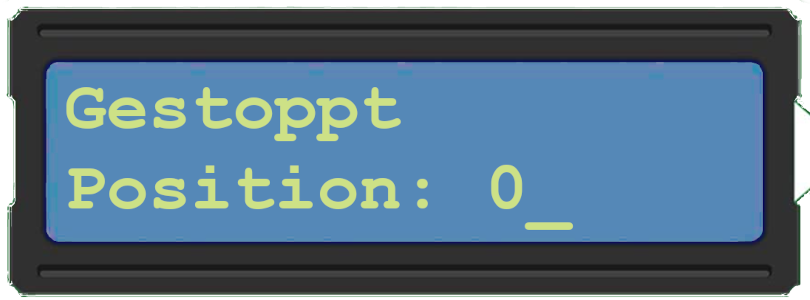
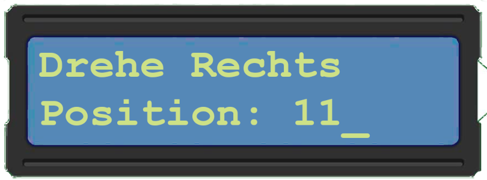
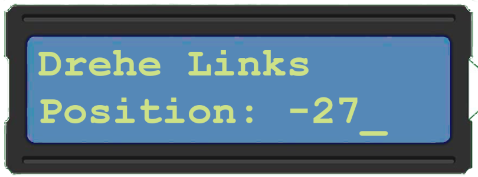

# Schrittmotor Steuerung mit NUCLEO-L152RE

### Hardware:
- [NUCLEO-L152RE](https://www.st.com/en/evaluation-tools/nucleo-l152re.html)
- [Arduino Multifunction Shield](https://www.amazon.de/dp/B07RHF9L99/)
- [Schrittmotor 28BYJ-48](https://www.amazon.de/dp/B07VGV1XFT/)
- [LCD Display](https://www.amazon.de/dp/B07JH6GHPR/)
### Software:
- [Mbed Studio](https://os.mbed.com/studio/)

### Statediagram

## Beschreibung
Der Programm nutzt drei LEDs und drei drei Tastern zum bedienen. 

Die LEDs sind als 0, 1 und 2 nummeriert und zeigen die Status 0. gestoppt, 1. dreheRecht und 2. dreheLinks. 

Genuso die drei Taster sind mit entsprechende funktion programmiert.
0. stop, 1. dreheRechts, 2. dreheLinks

Der Programm hat drei States/ **Zustände** nach der Startvorgang
### gestoppt:

1. **Taster-0** hat in dieser Zustand kein Funktion
2. **Taster-1** wechselt der zustand zur dreheRechts
3. **Taster-2** wechselt der zustand zur dreheLinks
### rechtsDrehen:

1. **Taster-0** wechselt der zustand zur gestoppt
2. **Taster-1** hat in dieser Zustand kein Funktion
3. **Taster-2** wechselt der zustand zur dreheLinks
### linksDrehen:

1. **Taster-0** wechselt der zustand zur gestoppt
2. **Taster-1** wechselt der zustand zur dreheRechts
3. **Taster-2** hat in dieser Zustand kein Funktion

---
## Zusatandstebelle
|Zusand|Taster-0|Taster-1|Taster-2|
|--|---|---|---|
|gestoppt|---|dreheRechts|dreheLinks|
|dreheRechts|gestoppt|---|dreheLinks|
|dreheLinks|gestoppt|dreheRechts|---|

---

Motor wird and die Pins PC8 bis PC11 angeschlossen. Storm wird derzeit auch von Nucleo besorgt. Wann gestartet